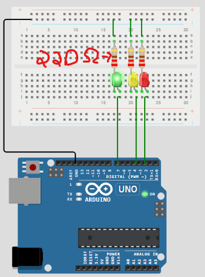

[**<- VOLTAR**](https://github.com/Leandro-Cardoso/Univassouras-IOT)

<table>
  <tr>
    <td width="50%">
      <pre><code>
const int green_time = 10 * 1000;
const int yellow_time = 3 * 1000;
const int red_time = 10 * 1000;
const int green_led = 7;
const int yellow_led = 4;
const int red_led = 2;
void led_cicle(int pin, int time) {
    digitalWrite(pin, HIGH);
    delay(time);
    digitalWrite(pin, LOW);
}
void setup() {
    // put your setup code here, to run once:
    pinMode(green_led, OUTPUT);
    pinMode(yellow_led, OUTPUT);
    pinMode(red_led, OUTPUT);
    Serial.begin(115200);
}
void loop() {
    // put your main code here, to run repeatedly:
    Serial.println("Verde acendeu !!!");
    led_cicle(green_led, green_time);
    Serial.println("Amarelo acendeu !!!");
    led_cicle(yellow_led, yellow_time);
    Serial.println("Vermelho acendeu !!!");
    led_cicle(red_led, red_time);
}
      </code></pre>
    </td>
    <td width="50%">
      
    </td>
  </tr>
</table>

[**<- VOLTAR**](https://github.com/Leandro-Cardoso/Univassouras-IOT)
