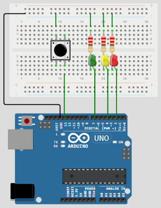

[**<- VOLTAR**](https://github.com/Leandro-Cardoso/Univassouras-IOT)

<table>
  <tr>
    <td width="50%">
      <pre><code>
const int green_time = 10 * 1000;
const int yellow_time = 3 * 1000;
const int red_time = 10 * 1000;
const int green_led = 7;
const int yellow_led = 4;
const int red_led = 2;
const int button = 13;
void stop() {
    delay(2000);
    digitalWrite(green_led, LOW);
    digitalWrite(yellow_led, HIGH);
    Serial.println("Amarelo acendeu !!!");
    delay(yellow_time);
    digitalWrite(yellow_led, LOW);
    digitalWrite(red_led, HIGH);
    Serial.println("Vermelho acendeu !!!");
    delay(red_time);
    digitalWrite(red_led, LOW);
    Serial.println("Verde acendeu !!!");
}
void setup() {
    // put your setup code here, to run once:
    pinMode(green_led, OUTPUT);
    pinMode(yellow_led, OUTPUT);
    pinMode(red_led, OUTPUT);
    Serial.begin(115200);
    Serial.println("Verde acendeu !!!");
}
void loop() {
    // put your main code here, to run repeatedly:
    if (digitalRead(button) == HIGH) {
      Serial.println("Apertou o botão !!!");
      digitalWrite(button, LOW);
      stop();
    }
    else {
      digitalWrite(green_led, HIGH);
    }
}
      </code></pre>
    </td>
    <td width="50%">
      
    </td>
  </tr>
</table>

[**<- VOLTAR**](https://github.com/Leandro-Cardoso/Univassouras-IOT)
