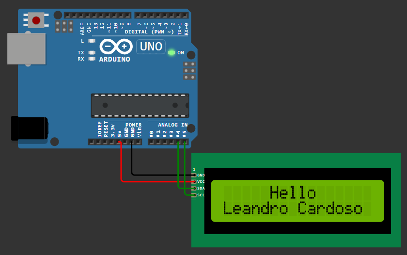

[**<- VOLTAR**](https://github.com/Leandro-Cardoso/Univassouras-IOT)

<table>
  <tr>
    <td width="50%">
      <pre><code>
#include < LiquidCrystal_I2C.h >

#define LCD_ADDR 0x27
#define LCD_COLLUNS 16
#define LCD_ROWS 2

LiquidCrystal_I2C lcd(LCD_ADDR, LCD_COLLUNS, LCD_ROWS);

void setup() {
  // put your setup code here, to run once:

  lcd.begin(16, 2);
  lcd.init();
  lcd.backlight();

  lcd.setCursor(5, 0);
  lcd.print("Hello");

  lcd.setCursor(0, 1);
  lcd.print("Leandro Cardoso");

}

void loop() {
  // put your main code here, to run repeatedly:

}
      </code></pre>
    </td>
    <td width="50%">
      
    </td>
  </tr>
</table>

[**<- VOLTAR**](https://github.com/Leandro-Cardoso/Univassouras-IOT)
